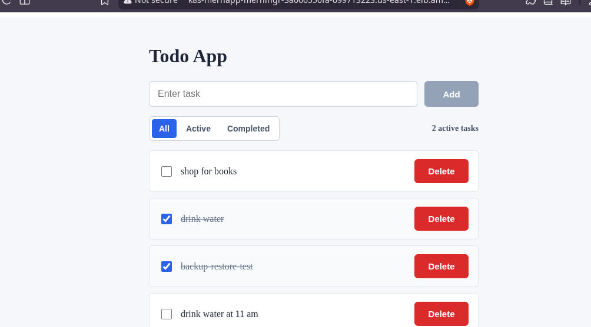
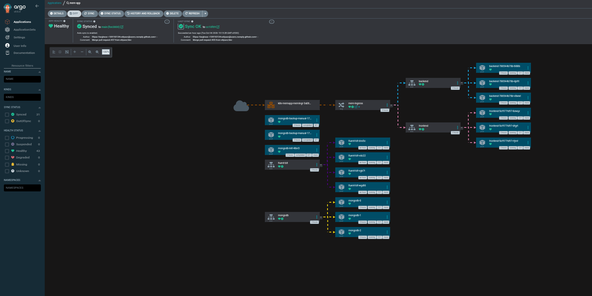
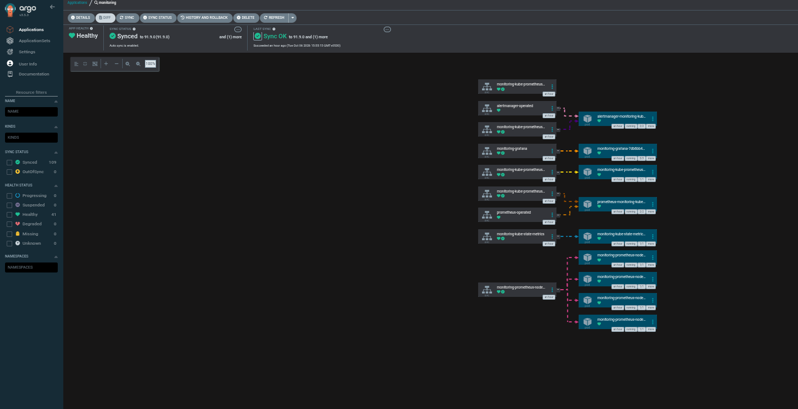
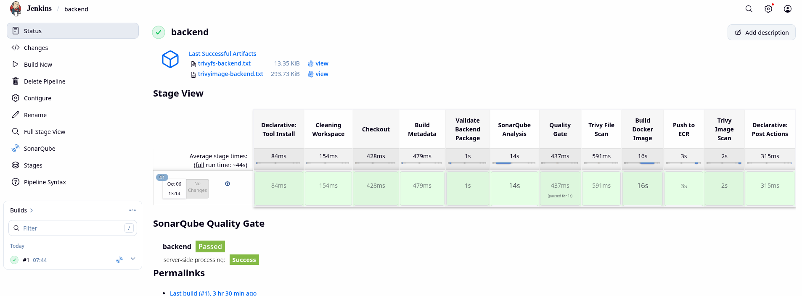
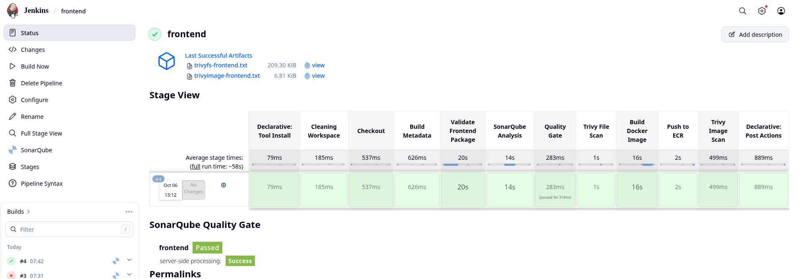
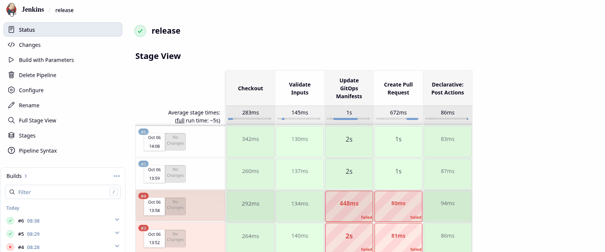
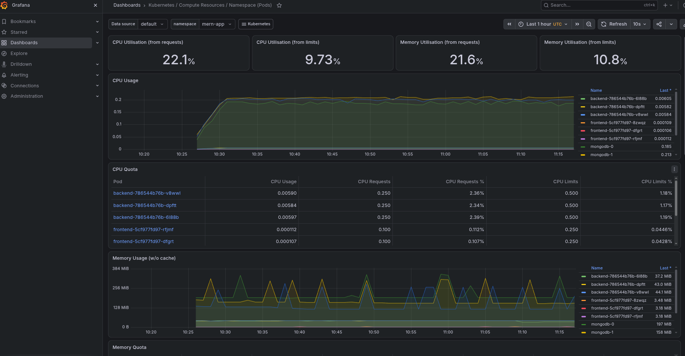
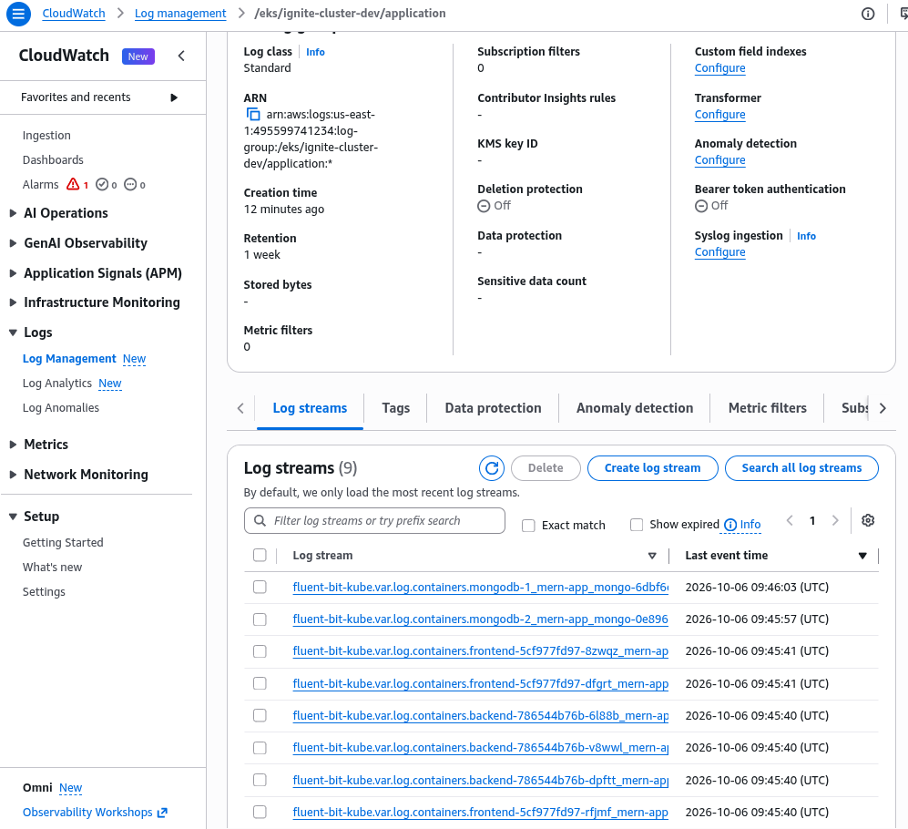
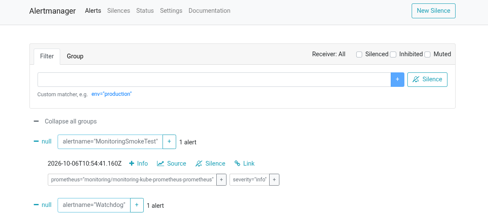
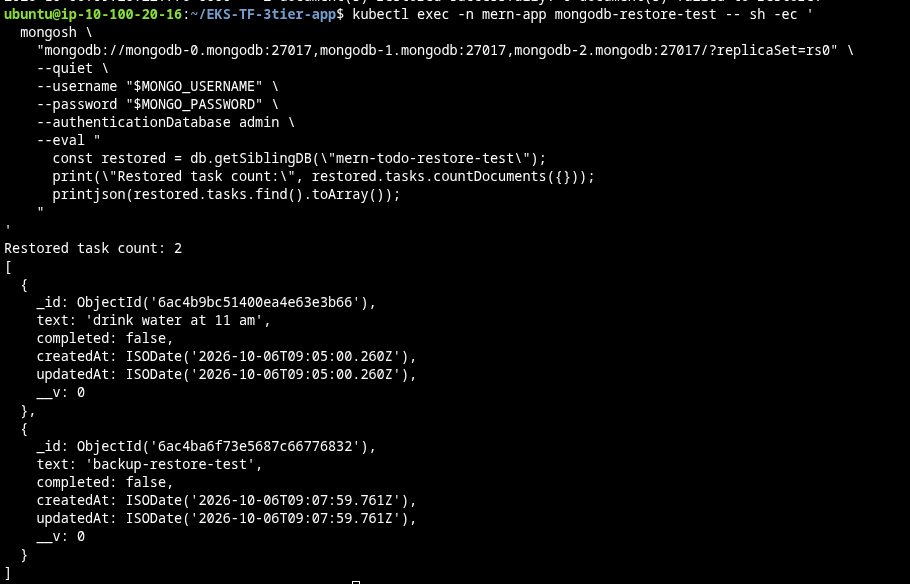

# EKS-TF-3tier-app

A production-style 3-tier application delivery repository for AWS EKS.
It uses Jenkins for CI, Argo CD for GitOps, and Kubernetes manifests for frontend, backend, and MongoDB deployment. Fluent Bit forwards application logs to CloudWatch using IRSA; a separate Argo CD application installs Prometheus, Grafana, and Alertmanager.

> This is a production-style learning project. End-to-end deployment requires an EKS cluster, ECR images, MongoDB secrets, Jenkins/Argo CD configuration, and environment-specific values. The dev ingress uses HTTP; a certificate is needed only when configuring HTTPS. Monitoring uses single replicas and has no external notification receiver configured.

## What this repo contains

- `App-Code/` - frontend and backend application code
- `Jenkins-pipeline/` - CI pipelines and GitOps release flow
- `k8s/` - Kubernetes manifests for application, database, logging, networking, and GitOps
- `observability/` - Helm values for the monitoring stack
- `docs/` - focus docs for CI/CD, Kubernetes resources, observability, security, and operations
- `asets/` - screenshots from the completed deployment

## Key concepts

- Jenkins builds and pushes Docker images to ECR
- A separate release pipeline updates `k8s/` manifests and creates a PR for Argo CD
- Argo CD syncs cluster state from Git
- MongoDB uses a 3-node replica set with a dedicated init Job
- Secrets are managed using AWS Secrets Manager and External Secrets
- Backend exposes health and readiness probes plus Prometheus-compatible `/metrics`
- MongoDB requires on-demand workers across three eligible AZs; application workloads require Spot workers
- Prometheus scrapes backend metrics; Grafana provides dashboards and Alertmanager receives alerts
- Metrics Server supplies HPA resource metrics independently of Prometheus

## Completed deployment

These screenshots show the application and monitoring stack during the completed deployment. The cluster was subsequently destroyed after testing.

### Application

The Todo UI shows saved tasks and completed items served through the application ingress.



### GitOps deployment

The MERN application is **Synced and Healthy**, with frontend/backend replicas, MongoDB, ingress, and Fluent Bit resources visible.



<details>
<summary>Monitoring application in Argo CD</summary>

The separate monitoring application is **Synced and Healthy**, with Prometheus, Grafana, Alertmanager, and exporters running.



</details>

<details>
<summary>Jenkins CI and GitOps release pipelines</summary>

The backend and frontend runs completed package validation, SonarQube analysis and quality gates, Trivy scans, Docker builds, and ECR pushes. Successful execution of a scan stage does not imply the image has no vulnerabilities.





The latest successful release runs updated GitOps manifests and created pull requests. Earlier failed attempts remain visible in the build history.



</details>

### Metrics and logs

The Kubernetes dashboard shows CPU and memory usage for the `mern-app` namespace, alongside resource requests and limits.



<details>
<summary>Centralized CloudWatch logging</summary>

The application log group has **one-week retention** and streams for frontend, backend, and MongoDB containers.



</details>

<details>
<summary>Alert delivery test</summary>

`MonitoringSmokeTest` is visible in Alertmanager, demonstrating delivery from Prometheus. The receiver is `null`; external email/webhook notifications were not configured.



</details>

<details>
<summary>MongoDB backup restore verification</summary>

Two task documents were verified in the separate `mern-todo-restore-test` database, including the backup test task.



</details>

## Quick start

1. Ensure the EKS cluster and required post-cluster add-ons exist:

- AWS Load Balancer Controller before applying `k8s/ingress.yaml`
- External Secrets Operator before deploying MongoDB secrets and database workloads
- Metrics Server before applying `k8s/hpa.yaml`
- Cluster Autoscaler if you want EKS nodes to scale when HPA creates unschedulable pods

2. Complete the [manual prerequisites](docs/redeployment.md): configure EKS access, ECR repositories, MongoDB Secrets Manager values, Jenkins, and Argo CD. Verify worker placement and capacity using [the operations guide](docs/operations.md).

3. Build and push frontend/backend images using Jenkins. Run the release pipeline with the exact image tags, review its PRs, and merge/promote the image manifests to `main`, which Argo CD watches. Use separate releases if the components have different tags.

4. Bootstrap the namespace, storage, and External Secrets, then verify both secrets are synced before enabling application reconciliation:

```bash
kubectl apply -f k8s/namespace.yaml
kubectl apply -f k8s/db/storageclass.yaml
kubectl apply -f k8s/external-secrets/
kubectl get secretstore,externalsecret -n mern-app
```

5. Apply the infrastructure's CloudWatch logging resources first, then apply the GitOps bootstrap manifests after the images and secrets are ready:

```bash
kubectl apply -f k8s/argocd/argocd-project.yaml
kubectl apply -f k8s/argocd/argocd-application.yaml
```

6. Verify Fluent Bit delivery to CloudWatch using [the logging guide](docs/cloudwatch-logging.md).
7. Create the Grafana admin Secret and bootstrap the separate monitoring project/application using [observability](docs/observability.md). Access Grafana, Alertmanager, and Argo CD privately through SSM port forwarding; keep their Services as ClusterIP.

The MERN Application syncs the existing logging manifests too, so the Terraform-created Fluent Bit role and log group must exist before that sync. Later releases follow the same build → release PR → merge → Argo CD flow.

## Recommended docs

- [Redeployment](docs/redeployment.md) - manual prerequisites and deployment order
- [CI/CD](docs/ci-cd.md) - Jenkins pipelines and release flow
- [Kubernetes resources](docs/k8s-resources.md) - manifest overview
- [CloudWatch logging](docs/cloudwatch-logging.md) - IRSA, retention, and delivery verification
- [Observability](docs/observability.md) - monitoring, SSM access, dashboards, and alert testing
- [Security and secrets](docs/security-and-secrets.md) - security hardening and secret management
- [Operations](docs/operations.md) - placement checks and troubleshooting
- [Teardown](docs/teardown.md) - ordered cleanup and AWS dependency checks

## Repository layout

```
App-Code/
Jenkins-pipeline/
k8s/
observability/
docs/
asets/
README.md
```

## Useful commands

```bash
kubectl get pods -n mern-app
kubectl get ingress -n mern-app
kubectl get hpa -n mern-app
kubectl get applications -n argocd
kubectl get pods,pvc -n monitoring
```

## Notes

This repository focuses on application delivery and Kubernetes deployment. Infrastructure provisioning is managed separately in the companion Terraform project.

Before destroying EKS, disable Argo CD automated sync and remove all project Ingress/LoadBalancer Services while their controllers are running. Check both Classic Load Balancers and ALBs/NLBs. Follow [teardown](docs/teardown.md) before deleting storage or the VPC.
